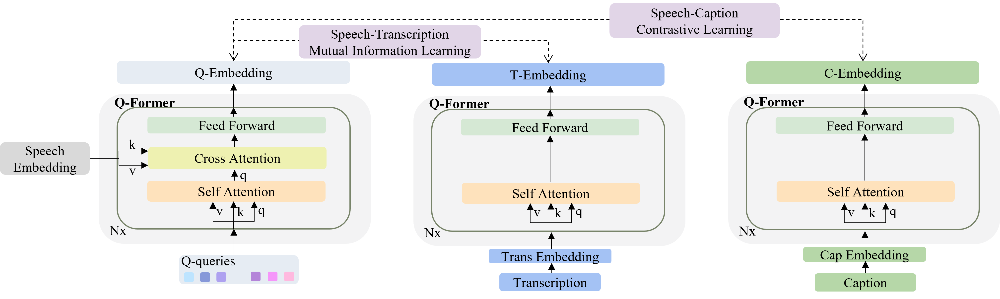

# SECAP: Speech Emotion Captioning with Large Language Model

# Abstract

Speech emotions are crucial in human communication and are extensively used in fields like speech synthesis and natural language understanding. Most prior studies, such as speech emotion recognition, have categorized speech emotions into a fixed set of classes.  Yet, emotions expressed in human speech are often complex, and categorizing them into predefined groups can be insufficient to adequately represent speech emotions. On the contrary, describing speech emotions directly by means of natural language may be a more effective approach. Regrettably, there are not many studies available that have focused on this direction.Therefore, this paper proposes a speech emotion captioning framework named \textit{SECap},aiming at effectively describing speech emotions using natural language.Owing to the impressive capabilities of large language models in language comprehension and text generation, SECap employs LLaMA as the text decoder to allow the production of coherent speech emotion captions. In addition, SECap leverages HuBERT as the audio encoder to extract general speech features and Q-Former as the Bridge-Net to provide LLaMA with emotion-related speech features. To accomplish this, Q-Former utilizes mutual information learning to disentangle emotion-related speech features and speech contents, while implementing contrastive learning to extract more emotion-related speech features. 
The results of objective and subjective evaluations demonstrate that:
1) the SECap framework outperforms the HTSAT-BART baseline in all objective evaluations;
2) SECap can generate high-quality speech emotion captions that attain performance on par with human annotators in subjective mean opinion score tests. 

    
     
    
 Figure1:Framework of the proposed SECap. 

    
     
    
 Figure2:The figure presents Q-Former decoupling audio representation and content information using Speech-Transcription Mutual Information Learning with speech features (Q-Embedding) and speech transcription features (T-Embedding). Additionally, it obtains more emotion-related audio representation through Speech-Caption Contrastive Learning with speech features (Q-Embedding) and speech emotion caption features (C-Embedding). 

<!-- # Subjective Evaluation -->

## Dataset samples

<table>
  <tr>
    <th>Wav</th>
    <th>Speech Transcription</th>
    <th>Human-Labeled Speach Emotion Label</th>
    <th>Human-Labeled Speach Emotion Caption</th>
  </tr>
  <tr>
    <td rowspan="3"><audio controls><source src="./wavs/tx_emotion_00201000008.wav" type="audio/wav">Your browser does not support the audio element.</audio></td>
    <td rowspan="3">是不是女人对爱总是一往情深,是不是女人都太过天真。</td>
    <td rowspan="3">伤心</td>
    <td>心里悲伤痛苦，酸楚且愤怒</td>
  </tr>
  <tr>
    <td>后悔难过，大声哭泣，心中充满悔恨和自责</td>
  </tr>
  <tr>
    <td>悲痛到无法自拔</td>
  </tr>
  <tr>
    <td rowspan="5"><audio controls><source src="./wavs/tx_xiao_0200103000507.wav" type="audio/wav">Your browser does not support the audio element.</audio></td>
    <td rowspan="5">我们一家三口上二楼,发现不排队,欣喜! </td>
    <td rowspan="5">开心</td>
    <td>语气十分欣喜，有些惊讶，带着喜出望外之感</td>
  </tr>
  <tr>
    <td>表明内心感到无比的惊喜和幸运，带有些许的得意之感。</td>
  </tr>
  <tr>
    <td>语气中透露自信、欢乐，带有些些自豪。</td>
  </tr>
  <tr>
    <td>语速较快，语调逐渐上扬，显示出内心的惊喜。</td>
  </tr>
  <tr>
    <td>语气激动，非常愉悦和得意。</td>
  </tr>
  <tr>
    <td rowspan="5"><audio controls><source src="./wavs/tx_xiao_0100104000109.wav" type="audio/wav">Your browser does not support the audio element.</audio></td>
    <td rowspan="5">你们看她那脏兮兮的衣服还穿反了。</td>
    <td rowspan="5">生气</td>
    <td>声嘶力竭的吼，音调高，情绪激动愤怒。</td>
  </tr>
  <tr>
    <td>语速快，声调越来越高，声音昂扬，形容很想发怒。</td>
  </tr>
  <tr>
    <td>语气带着嘲讽，情绪里满是轻蔑。</td>
  </tr>
  <tr>
    <td>语气中饱含着不满与嫌弃厌恶之感，还有一丝轻蔑。</td>
  </tr>
  <tr>
    <td>语言急促，声音严厉，音量大。</td>
  </tr>
</table>

## Test samples

| Wav | Human-Labeled Speach Emotion Label | Human-Labeled Speach Emotion Caption | SECap generated speech emotion caption |
| :---- | :---- | :---- | :---- |
| <audio controls><source src="./wavs/tx_emotion_00303000260.wav" type="audio/wav">Your browser does not support the audio element.</audio> | 快乐 | 心情快乐舒畅 | 快乐而愉悦，心情舒畅 |
| <audio controls><source src="./wavs/tx_emulate_02_231_0008_000034.wav" type="audio/wav">Your browser does not support the audio element.</audio> | 愤怒 | 语调高扬，反对的语气，突出内心的不满和愤怒 | 语速较快，声音较高，情绪中带着一丝不满 |
| <audio controls><source src="./wavs/tx_xiao_0200103000102.wav" type="audio/wav">Your browser does not support the audio element.</audio> | 激动 | 又惊又喜，语气中充满喜悦和惊讶 | 满怀期待的语气，情绪中透着激动和兴奋 |
| <audio controls><source src="./wavs/tx_xiao_0200107000936.wav" type="audio/wav">Your browser does not support the audio element.</audio> | 悲伤 | 表明内心充满委屈和不满，流露出极度的悲伤 | 情绪波动较大，语气中充满了委屈和难过 |
| <audio controls><source src="./wavs/tx_emulate_02_245_0001_000034.wav" type="audio/wav">Your browser does not support the audio element.</audio> | 激动 | 声音高亢尖利，语气里带着不悦，情绪激动，非常恼怒的情绪 | 语气激昂，内心十分不开心，而且特别的愤怒 |
| <audio controls><source src="./wavs/tx_emulate_00_109_0004_000071.wav" type="audio/wav">Your browser does not support the audio element.</audio> | 激动 | 语速极快，情绪中非常不爽，声音很尖锐，后面又流露放缓了态度 | 语气中带有一种不满和不耐烦的情绪，还有一点抱怨 |
| <audio controls><source src="./wavs/tx_emulate_01_003_0003_000018.wav" type="audio/wav">Your browser does not support the audio element.</audio> | 快乐 | 非常高兴，话语中透露着喜欢和愉悦 | 语气中透露着一种愉悦的心情，还有一点的期待 |

