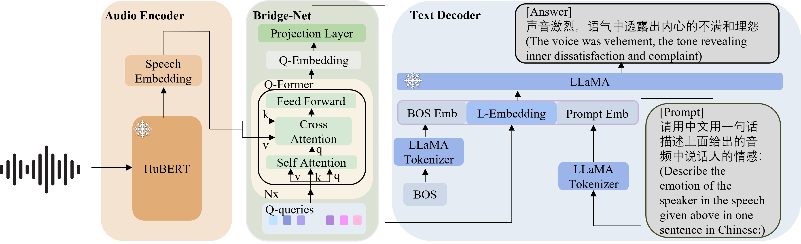

# Joint Multi-scale Cross-lingual Speaking Style Transfer with Bidirectional Attention Mechanism for Automatic Dubbing

# Abstract

Automatic dubbing, which generates a corresponding version of the input speech in another language, could be widely utilized in many real-world scenarios such as video and game localization. In addition to synthesizing the translated scripts, automatic dubbing needs to further transfer the speaking style in the original language to the dubbed speeches
to give audiences the impression that the characters are speaking in their native tongue.
However, state-of-the-art automatic dubbing systems only model the transfer on duration and speaking rate, neglecting the other aspects in speaking style such as emotion, intonation and emphasis which are also crucial to fully perform the characters and speech understanding. 
In this paper, we propose a joint multi-scale cross-lingual speaking style transfer framework to simultaneously model the bidirectional speaking style transfer between languages at both global (i.e. utterance level) and local (i.e. word level) scales.
The global and local speaking styles in each language are extracted and utilized to predicted the global and local speaking styles in the other language with an encoder-decoder framework for each direction and a shared bidirectional attention mechanism for both directions.
A multi-scale speaking style enhanced FastSpeech 2 is then utilized to synthesize the predicted the global and local speaking styles to speech for each language. Experiment results demonstrate the effectiveness of our proposed framework, which outperforms a baseline with only duration transfer in both objective and subjective evaluations.

    
     
    
 Fig.1: The the proposed joint multi-scale cross-lingual speaking style transfer model. 

<!-- # Subjective Evaluation -->

## Dataset samples

<table>
  <tr>
    <th>Wav</th>
    <th>Speech Transcription</th>
    <th>Human-Labeled Speach Emotion Label</th>
    <th>Human-Labeled Speach Emotion Caption</th>
  </tr>
  <tr>
    <td rowspan="3"><audio controls><source src="./wavs/tx_emotion_00201000008.wav" type="audio/wav">Your browser does not support the audio element.</audio></td>
    <td rowspan="3">是不是女人对爱总是一往情深,是不是女人都太过天真。</td>
    <td rowspan="3">伤心</td>
    <td>心里悲伤痛苦，酸楚且愤怒</td>
  </tr>
  <tr>
    <td>后悔难过，大声哭泣，心中充满悔恨和自责</td>
  </tr>
  <tr>
    <td>悲痛到无法自拔</td>
  </tr>
  <tr>
    <td rowspan="5"><audio controls><source src="./wavs/tx_xiao_0200103000507.wav" type="audio/wav">Your browser does not support the audio element.</audio></td>
    <td rowspan="5">我们一家三口上二楼,发现不排队,欣喜! </td>
    <td rowspan="5">开心</td>
    <td>语气十分欣喜，有些惊讶，带着喜出望外之感</td>
  </tr>
  <tr>
    <td>表明内心感到无比的惊喜和幸运，带有些许的得意之感。</td>
  </tr>
  <tr>
    <td>语气中透露自信、欢乐，带有些些自豪。</td>
  </tr>
  <tr>
    <td>语速较快，语调逐渐上扬，显示出内心的惊喜。</td>
  </tr>
  <tr>
    <td>语气激动，非常愉悦和得意。</td>
  </tr>
  <tr>
    <td rowspan="5"><audio controls><source src="./wavs/tx_xiao_0100104000109.wav" type="audio/wav">Your browser does not support the audio element.</audio></td>
    <td rowspan="5">你们看她那脏兮兮的衣服还穿反了。</td>
    <td rowspan="5">生气</td>
    <td>声嘶力竭的吼，音调高，情绪激动愤怒。</td>
  </tr>
  <tr>
    <td>语速快，声调越来越高，声音昂扬，形容很想发怒。</td>
  </tr>
  <tr>
    <td>语气带着嘲讽，情绪里满是轻蔑。</td>
  </tr>
  <tr>
    <td>语气中饱含着不满与嫌弃厌恶之感，还有一丝轻蔑。</td>
  </tr>
  <tr>
    <td>语言急促，声音严厉，音量大。</td>
  </tr>
</table>

## Test samples

| Wav | Human-Labeled Speach Emotion Label | Human-Labeled Speach Emotion Caption | SECap generated speech emotion caption |
| :---- | :---- | :---- | :---- |
| <audio controls><source src="./wavs/tx_emotion_00303000260.wav" type="audio/wav">Your browser does not support the audio element.</audio> | 快乐 | 心情快乐舒畅 | 快乐而愉悦，心情舒畅 |
| <audio controls><source src="./wavs/tx_emulate_02_231_0008_000034.wav" type="audio/wav">Your browser does not support the audio element.</audio> | 愤怒 | 语调高扬，反对的语气，突出内心的不满和愤怒 | 语速较快，声音较高，情绪中带着一丝不满 |
| <audio controls><source src="./wavs/tx_xiao_0200103000102.wav" type="audio/wav">Your browser does not support the audio element.</audio> | 激动 | 又惊又喜，语气中充满喜悦和惊讶 | 满怀期待的语气，情绪中透着激动和兴奋 |
| <audio controls><source src="./wavs/tx_xiao_0200107000936.wav" type="audio/wav">Your browser does not support the audio element.</audio> | 悲伤 | 表明内心充满委屈和不满，流露出极度的悲伤 | 情绪波动较大，语气中充满了委屈和难过 |
| <audio controls><source src="./wavs/tx_emulate_02_245_0001_000034.wav" type="audio/wav">Your browser does not support the audio element.</audio> | 激动 | 声音高亢尖利，语气里带着不悦，情绪激动，非常恼怒的情绪 | 语气激昂，内心十分不开心，而且特别的愤怒 |
| <audio controls><source src="./wavs/tx_emulate_00_109_0004_000071.wav" type="audio/wav">Your browser does not support the audio element.</audio> | 激动 | 语速极快，情绪中非常不爽，声音很尖锐，后面又流露放缓了态度 | 语气中带有一种不满和不耐烦的情绪，还有一点抱怨 |
| <audio controls><source src="./wavs/tx_emulate_01_003_0003_000018.wav" type="audio/wav">Your browser does not support the audio element.</audio> | 快乐 | 非常高兴，话语中透露着喜欢和愉悦 | 语气中透露着一种愉悦的心情，还有一点的期待 |

